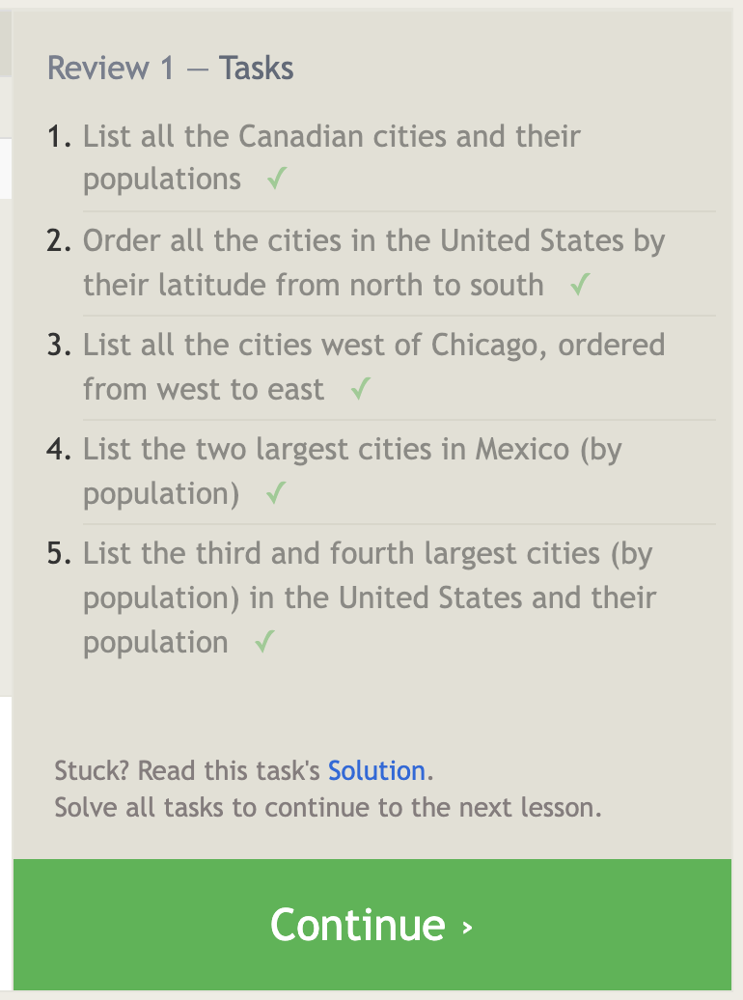
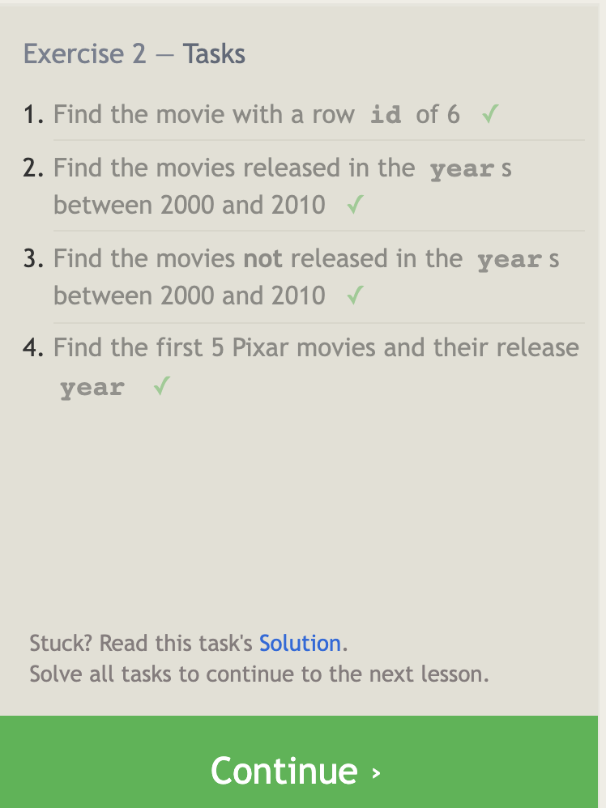
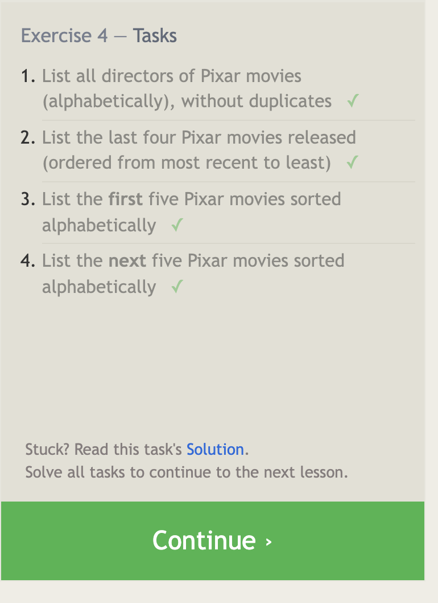
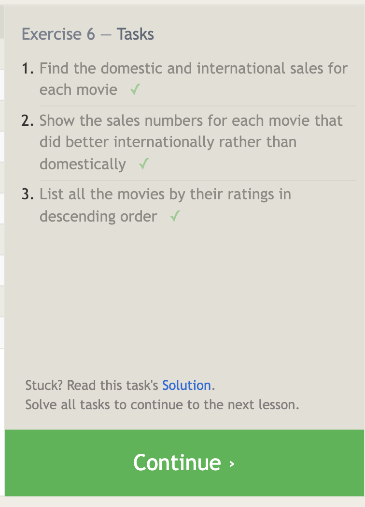
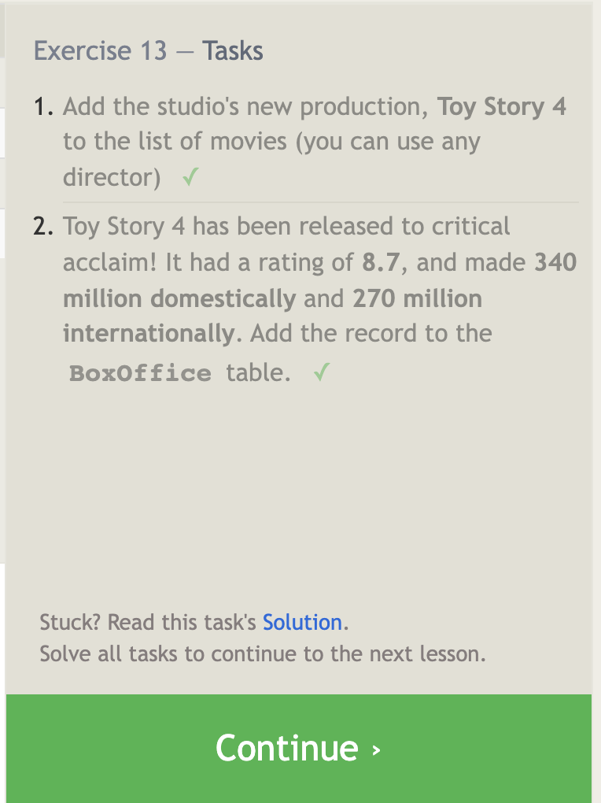
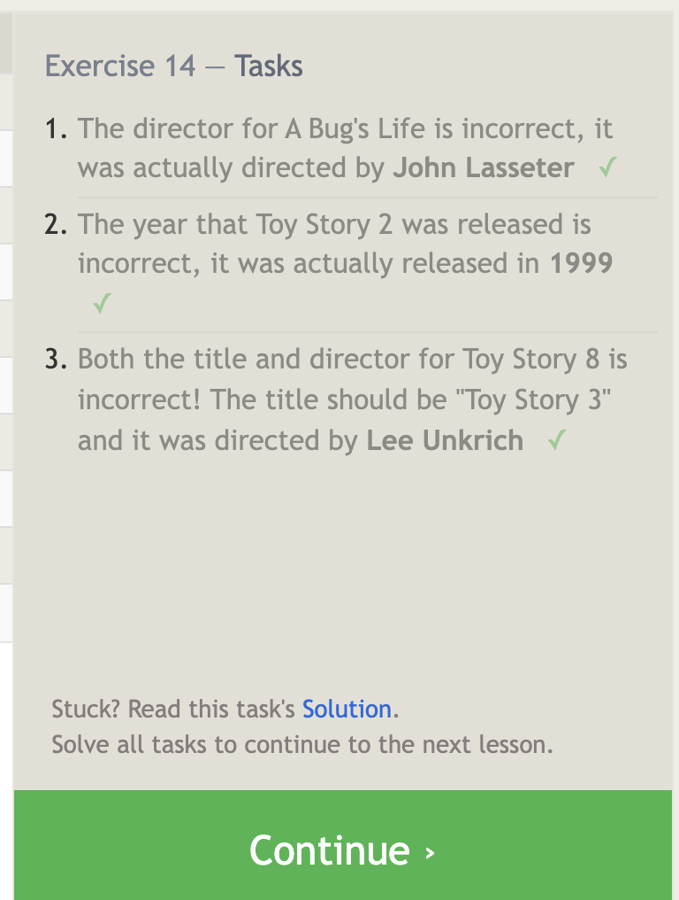
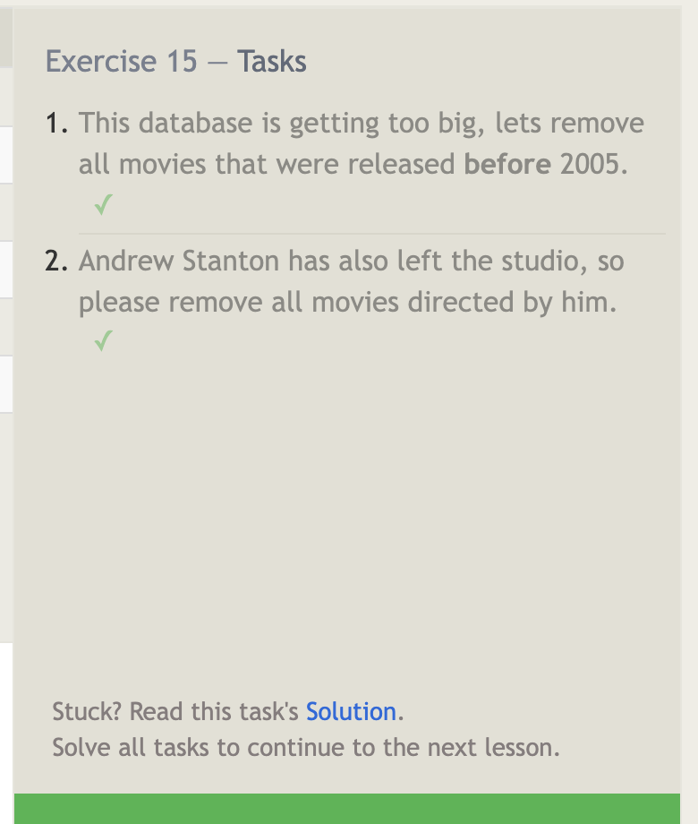
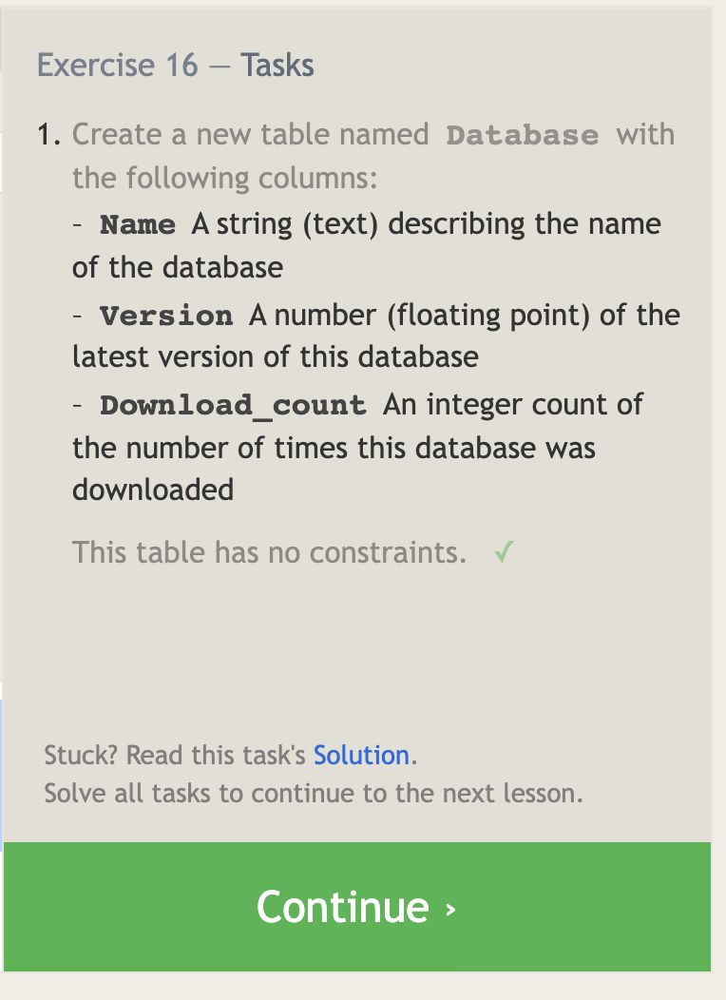
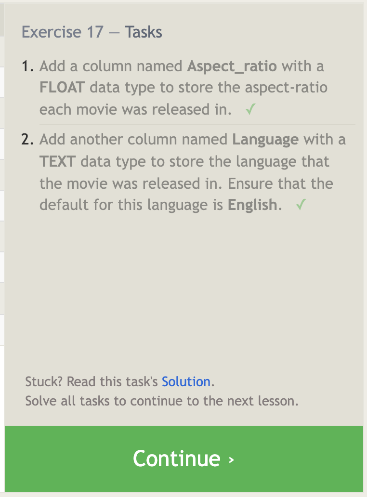
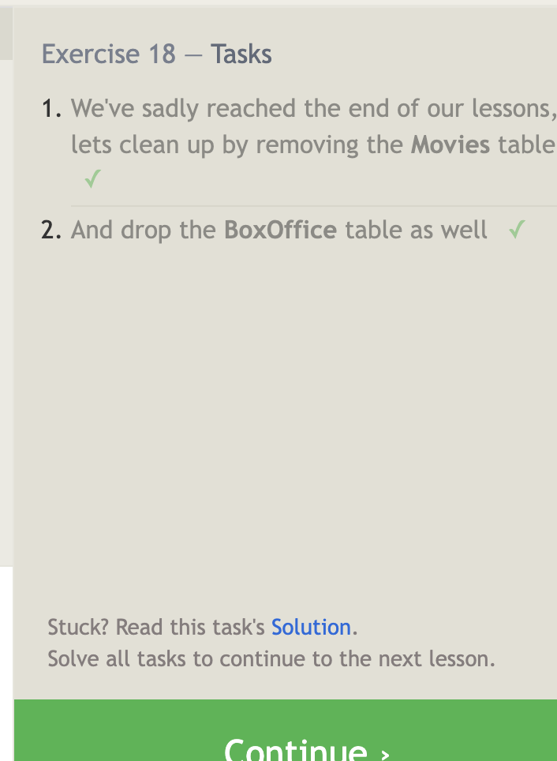

# [Reading-Notes](https://alsosteve.github.io/reading-notes/)
Code Fellows Python 401

# Read: P1 - Prep: Introduction to SQL

## [Learn SQL: E-Book](https://landing.chartio.com/download-learn-sql)

## [SQL Bolt: Practice Tutorials](https://sqlbolt.com/)

